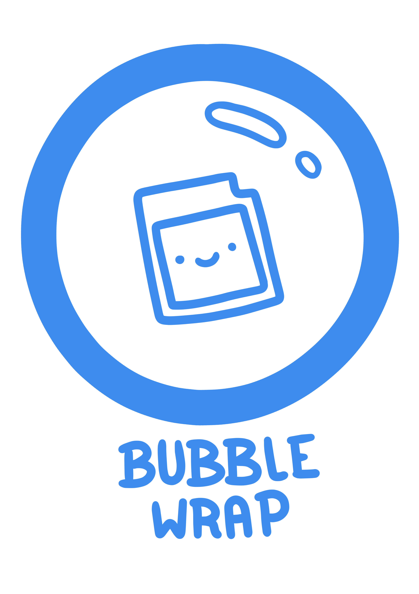

# Note
We do not condone nor support using this for illegal ROM files! This was designed to help homebrew devs!
# Quickstart on Windows
- NPM needs to be installed (https://nodejs.org/en/download)
- Put your rom into "rom/game.gb"
- On the first time only: doubleclick "install.bat" to install dependencies
- Doubleclick test.bat to test your app
- Doubleclick createInstaller.bat to create an installer for the current system. The installer will be created in a folder called "out".
- Detailed instructions can be read below in the section "Instruction"
# About
## BubbleWrap
BubbleWrap is a collection of different tools to allow you wrap your homebrew GB rom into an executable file (e.g. ".exe"). It is made possible by mooonbit and timbojay.
Why is it called BubbleWrap? Because it was originally made to bring BubbleFrog to steam. BubbleFrog is timbojay's original GB Game (https://timbojay.itch.io/bubblefrog).

See below to learn about the different tools used in this package.

## Redistribute?
BubbleWrap is free to use and distributing your game is permitted.

## Why use BubbleWrap instead of building with electron directly?
Because we found a way to play the sound directly on opening the exe (without clicking the window).
This was made possible by the index.js file, which already starts the electron browser with a flag that allows playing sounds without clicking. We also edited binji's emulator script to start the music directly.

## You need help?
If you need a feature or you have a bug you can contact mooonbit via instagram mooonbit.studio or write an email: (same as the instagram but add @gmail.com)

# Instruction
## Basics
Put your GB rom into "rom" folder and rename it to "game.gb".
Change icon in "images/icon.ico".
Change Background image in "image/background.webp".
Change window title:
In the menu.html and index.html replace the text inside the <title></title> tag to change the window name.

### Configuration
At the top of index.js you can change the following parameters to change the appereance of the window:
height: window height
width: window width,
fullscreen: can be true or false: start with or without fullscreen mode

### With title-menu in html
Edit "menu.html" HTML file to your wishes if you want to display a custom menu before starting up the game.

#### Debug the title-menu
To debug the App's html and js you can set debug = true in index.js at the top.

### Without title-menu
Edit the index.js file in the root folder. On top of the file replace "menu.html" with "index.html":
'const file = index.html'.

## Test & Build
- NPM needs to be installed (https://nodejs.org/en/download)
- On the first time: Open terminal in the BubbleWrap folder, type and run "npm install". Wait until it's finished. After this run "npm install --save-dev @electron-forge/plugin-fuses". Wait again until finished.

- To test your app, open the terminal in root folder, type and run: "npm run start"
- To create an installer of your game for your current OS, do as follows:
Open terminal, type and run in root folder: "npm run make"
If you want to create standalone executables for windows run:
"npx electron-packager "./" "BubbleWrap" --platform=win32 --arch="x64"". This creates a folder with the ".exe" file. A full list of supported plattforms for packaging your game can be found at https://github.com/electron/packager/blob/main/README.md#supported-platforms

# How does BubbleWrap work?
## binjgb files generated with GB Studio
Fork of binji's Game Boy emulator built as a WebAssembly module.

It includes changes from [Daid's fork](https://github.com/daid/binjgb) and others to better support GB Studio.

## electron-forge
Electron Forge is an all-in-one tool for packaging and distributing Electron applications. It combines many single-purpose packages to create a full build pipeline that works out of the box, complete with code signing, installers, and artifact publishing.
